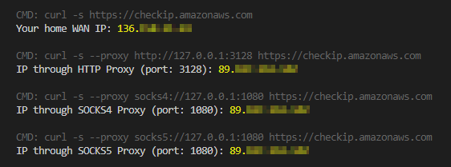

# CPTO:HAPROXY

This is a part/submodule of the "Containerized HTTP/SOCKS Proxy Through OpenVPN" (CPTO) project.



CPTO will expose HTTP/SOCKS proxy ports that forwards traffic through the OpenVPN client configured. Perfect for those that don't want/need to have their entire host machine be on the OpenVPN network.

> **WARNING**: This project was made for educational purposes (and convenience). Please DO NOT USE for PRODUCTION or COMMERCIAL deployments.

... also serves as demonstration of:
- Non-typical `docker`/`docker-compose` (POD-like) networking _([official doc](https://docs.docker.com/compose/compose-file/compose-file-v2/#network_mode))_
- YAML anchors in `docker-compose.yaml` _([guide by medium.com](https://medium.com/@kinghuang/docker-compose-anchors-aliases-extensions-a1e4105d70bd))_
- Working with Alpine images _([official site](https://alpinelinux.org/about/) / [in docker hub](https://hub.docker.com/_/alpine))_
- `docker` Multi-stage builds _([official doc](https://docs.docker.com/develop/develop-images/multistage-build/))_
- Git submodules _([official doc](https://git-scm.com/book/en/v2/Git-Tools-Submodules))_
- Oldie-but-Goodie (and tiny) open-source networking apps/tools:
  - tinyproxy _([official site](http://tinyproxy.github.io/) / [github](https://github.com/tinyproxy/tinyproxy))_
  - srelay _([official site](https://socks-relay.sourceforge.io/) / [sourceforge](https://sourceforge.net/p/socks-relay/srelay/ci/master/tree/))_
  - haproxy _([official site](http://www.haproxy.org/) / [github](https://github.com/haproxy/haproxy))_

**REF:** https://github.com/jpbaking/cpto

# CPTO Usage

## **Step #1:** Clone the CPTO repository

```bash
$ git clone git@github.com:jpbaking/cpto.git
$ cd cpto
```

This `.git` repository is basically a `docker-compose` project:

```bash
$ ls -la
total 56
drwxrwxr-x  8 user group 4096 May  6 16:01 .
drwxrwxr-x 10 user group 4096 May  6 15:31 ..
-rwxrwxr-x  1 user group  307 May  6 15:31 compose.sh
drwxrwxr-x  2 user group 4096 May  6 15:33 cpto-haproxy
drwxrwxr-x  2 user group 4096 May  6 15:33 cpto-openvpn
drwxrwxr-x  2 user group 4096 May  6 15:33 cpto-srelay
drwxrwxr-x  2 user group 4096 May  6 15:33 cpto-tinyproxy
-rw-rw-r--  1 user group 1110 May  6 15:50 docker-compose.yaml
-rw-rw-r--  1 user group 1491 May  6 16:06 .env
drwxrwxr-x  9 user group 4096 May  6 15:32 .git
-rw-rw-r--  1 user group   15 May  6 15:31 .gitignore
-rw-rw-r--  1 user group  387 May  6 15:31 .gitmodules
drwxr-xr-x  2 user group 4096 May  6 15:53 .openvpn
-rw-rw-r--  1 user group 2601 May  6 16:14 README.md
```

Feel free to use the `compose.sh` bash script. It basically is a `docker-compose` helper/shortcut that checks if `docker` and `docker-compose` are installed, and consistently supplies the `--project-name=cpto` argument.

### **OPTIONAL:** "pull" the submodules:

If you're curious or want to hack something:
```bash
$ git submodule update --init --recursive
```
Enjoy!~

## **Step #2:** Configuration (REQUIRED)

Modify the [docker compose `.env`](https://docs.docker.com/compose/environment-variables/#the-env-file) file:

```bash
# -------------------------------------------------------------------------
# [OPENVPN_CONFIG_DIR]
# The folder that holds your OpenVPN client configuration (and possibly a
# password file as well). If you do not need to pass configuration files
# (eg: if you only need OpenVPN arguments), you may leave the detault value
# as-is (it won't have any effect anyway).
# -------------------------------------------------------------------------
OPENVPN_CONFIG_DIR="./.openvpn"

# -------------------------------------------------------------------------
# [OPENVPN_CMD_ARGS]
# This exactly is what will be fed as arguments/parameters to OpenVPN.
# Something like: `openvpn ${OPENVPN_CMD_ARGS}`
# NOTE: The working directory in the container will be the mounted volume
#       pointing to the directory specified in `OPENVPN_CONFIG_DIR`.
# -------------------------------------------------------------------------
OPENVPN_CMD_ARGS="--config client.ovpn --auth-user-pass client.pass --auth-nocache"

# -------------------------------------------------------------------------
# [HTTP_PROXY_PORT]
# The port to expose for HTTP Proxy (tinyproxy).
# -------------------------------------------------------------------------
HTTP_PROXY_PORT="3128"

# -------------------------------------------------------------------------
# [SOCKS_PROXY_PORT]
# The port to expose for SOCKS4/SOCKS5 Proxy (srelay).
# -------------------------------------------------------------------------
SOCKS_PROXY_PORT="1080"
```

## **Step #3:** Docker Compose CLI

`compose.sh` ([docker-compose](https://docs.docker.com/compose/reference/)) usage:

* "Start": `./compose.sh pull && ./compose.sh up --detach --no-build`
* "Stop": `./compose.sh down`
* List Containers: `./compose.sh ps`
* Tail-Follow Logs: `./compose.sh logs -f --tail 100`
* I hacked something, now...
  * Build: `./compose.sh build`
  * Build & "Start": `./compose.sh up --detach --build`

**REF:** [https://docs.docker.com/compose/reference/](https://docs.docker.com/compose/reference/)


## **Step #4:** Test (optional)

Just execute `test.sh`! It will also show you sample usage with `curl`:

```bash
$ ./test.sh

CMD: curl -s https://checkip.amazonaws.com
Your home WAN IP: 111.111.111.111

CMD: curl -s --proxy http://127.0.0.1:3128 https://checkip.amazonaws.com
IP through HTTP Proxy (port: 3128): 222.222.222.222

CMD: curl -s --proxy socks4://127.0.0.1:1080 https://checkip.amazonaws.com
IP through SOCKS4 Proxy (port: 1080): 222.222.222.222

CMD: curl -s --proxy socks5://127.0.0.1:1080 https://checkip.amazonaws.com
IP through SOCKS5 Proxy (port: 1080): 222.222.222.222
```